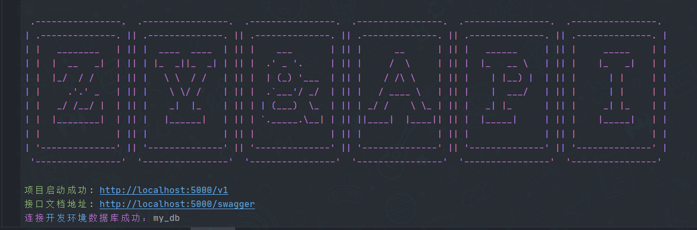
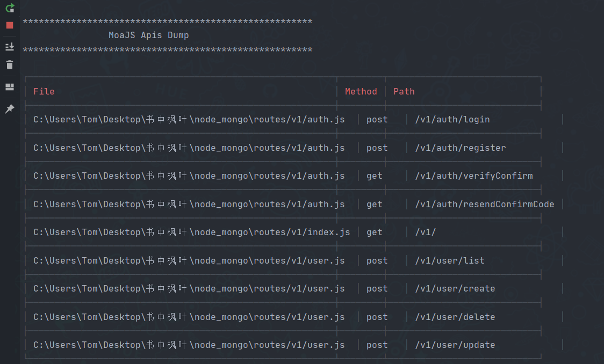

# ZY.Node.Mongodb 

- https://gitee.com/Z568_568/node.mongodb.git

- https://github.com/ZHYI-source/ZY.Node.Mongodb.git

#### 项目介绍

---
- 基于 Node.js、Express.js 和 MongoDB 通过Mongoose驱动进行 REST API 开发的轻量级样板。
  集成了Swagger UI、JWT、sessionMiddleware、发送邮箱验证、日志管理、统一的预定义状态码响应格式等，对于为前端平台构建纯净的Web API非常有用。

- 该项目我尝试做出轻松维护代码结构的项目样板，因为任何初学者也可以采用该流程并开始构建API。 

- 项目开放，可以提出建议、错误的issues。


#### 项目特点

---

- 轻量级Node.js项目提供Restful API
- 数据库采用 Mongodb, 通过Mongoose驱动。
- CRUD操作示例
- 跨域处理
- 日志管理
- 具有恰当的状态代码的预定义响应结构
- 全局错误处理
- 增加express-validator请求参数校验
- jwt验证 用户权限中间件分离
- 基本身份验证（采用bcrypt单向Hash加密算法加密密码进行注册/登录）
- Token生成和校验请求头的authorization 
- 集成swagger-ui
- 增加邮件验证码通知
- sessionMiddleware 验证码校验
- 采用jest 接口单元测试
- 集成定时任务


#### 如何获得并运行项目：

---

> 首先确保您系统中安装了[Mongodb](http://www.mongodb.org/)，和[Nodejs](http://nodejs.org/ "Nodejs")，一起准备完善之后。按照如下操作。
> 有的同学启动会报错可能是依赖包的版本问题需要注意
> 我的环境配置供参考 
> - Node.js 14.18.1+ 
> - MongoDB 5.1+

**1，clone代码**

 >  `git clone https://gitee.com/Z568_568/node.mongodb.git`
 
**2，安装依赖**

 >  `npm install`

**3，启动程序**

 >  `开发环境：npm run dev  基于 nodemon 热更新`
 >  `生产环境：npm run start`

**4，启动成功示例**




#### 如何增加新的model

---
只需在 `/models/v1/mapping/` 中创建一个新文件，
然后在控制器`/controllers/v1/`中创建一个对应新模型的新控制器的并使用。

#### 如何增加新的路由router

---
只需在 `/routes/v1/` 中创建一个新文件，并且引入它对应的controllers进行使用，routes下面的文件 将被 `mount-routes`插件自动解析并以文件名作为api根路径，
开发环境下会打印在终端上：



#### 如何增加新的控制器

---
只需在 `/controllers/v1/` 中创建一个新文件即可，并且引入相关模型进行使用


#### 如何理解内置的登录注册逻辑

```js

/*
* TODO: 注册登录大概逻辑：
*       1.用户注册 - 用户信息入库 - 发送验证码 - 校验验证码
*                                   |
*                           验证码发送失败、验证码失效或者校验失败 - 重新发送或输入验证码 - 校验验证码
*   *
*       2.用户登录 -（账号、密码、验证状态都校验通过）- 发Token
*                       |
*                 验证状态不通过 - 重新校验验证码/重发验证码 - 校验验证码 - 发Token
* */

```

#### 项目结构

---

```sh
.
├── app.js                  //入口文件
├── package.json            //依赖配置文件
├── .env.development        //开发环境配置
├── .env.production         //生产环境配置
├── config                  //项目配置
│   ├── db.config.js
│   ├── swagger.config.js
│   └── ...
├── controllers             //控制模块（业务处理）
│   └── v1
│       ├── TestUserController.js
│       └── ...
├── models                  //模型模块（建表）
│   └── v1
│       ├── user.test.js        /模型统一导出
│       └── mapping
│           ├──TestUserModel.js
│           └── ...
├── routes                  //路由（配置实际API地址路径）
│     └── v1
│         ├── user.test.js
│         ├── test_user.js
│         └── ...
├── db                      //mongodb数据库连接
│   ├── user.test.js              
│   └── ...
├── middlewares             //中间件
│   ├── tokenAuthentication.js
│   ├── authMiddleware.js
│   ├── sessionMiddleware.js
│   └── ...
├── logs                    //日志
│   ├── info.log
│   ├── error.log
│   └── ...
└── utils                   //辅助工具
    ├── utils.apiResponse.js
    ├── utils.mailer.js.js
    └── ...
```

#### 关于作者

---
创建和维护由
 - [@ZY_GITEE](https://gitee.com/Z568_568) 
 - [@ZY_GITHUB](https://github.com/ZHYI-source)
 - 想咨询其他或合作请发我邮箱1840354092@qq.com
 - 到我主页留言[http://www.zhouyi.run](http://www.zhouyi.run/#/About)
 - 我的博客站点[http://blog.zhouyi.run](http://blog.zhouyi.run/#/)

#### 感谢作者
如果该项目对你有帮助的话 可以通过扫下面二维码打赏来感谢我的努力和花费的时间来创建这个有用的项目。

<div>
    
    
</div>

#### License

---

[MIT](https://choosealicense.com/licenses/mit/)

```lc
MIT License

Copyright (c) 2023 周Y

Permission is hereby granted, free of charge, to any person obtaining a copy
of this software and associated documentation files (the "Software"), to deal
in the Software without restriction, including without limitation the rights
to use, copy, modify, merge, publish, distribute, sublicense, and/or sell
copies of the Software, and to permit persons to whom the Software is
furnished to do so, subject to the following conditions:

The above copyright notice and this permission notice shall be included in all
copies or substantial portions of the Software.

THE SOFTWARE IS PROVIDED "AS IS", WITHOUT WARRANTY OF ANY KIND, EXPRESS OR
IMPLIED, INCLUDING BUT NOT LIMITED TO THE WARRANTIES OF MERCHANTABILITY,
FITNESS FOR A PARTICULAR PURPOSE AND NONINFRINGEMENT. IN NO EVENT SHALL THE
AUTHORS OR COPYRIGHT HOLDERS BE LIABLE FOR ANY CLAIM, DAMAGES OR OTHER
LIABILITY, WHETHER IN AN ACTION OF CONTRACT, TORT OR OTHERWISE, ARISING FROM,
OUT OF OR IN CONNECTION WITH THE SOFTWARE OR THE USE OR OTHER DEALINGS IN THE
SOFTWARE.

```


 
