# ZY·Admin【完整版】 Vue3-Antd-Plus (文档更新中)

<p align="center">
  <a href="https://gitee.com/Z568_568/mango-blog-system.git">
    
  </a>

<h3 align="center">" 🔥 Vue3-Antd-Plus "</h3>
  <p align="center">
    基于 Vue3 + js 现代化的管理系统【完整版】
    <br />
    <a href="https://gitee.com/Z568_568/vue3-antd-plus.git" target="_blank"><strong>探索本项目的源码 »</strong></a>
    <br />

[comment]: <> (<a href='https://gitee.com/Z568_568/ZY-Admin/stargazers'></img></a>)

[comment]: <> (<a href='https://gitee.com/Z568_568/ZY-Admin/members'></img></a>)
</p>
</p>

Vue3-Antd-Plus是一个现代化的管理系统，提供了一系列功能丰富的组件和工具，帮助开发者快速搭建和开发管理后台应用。

**基于 Vue 3 + JavaScript + Pinia +Vite + Ant Design Vue 构建 管理后台+web前台+Node后端代码一整套**

做这个项目主要原因：全网大都是 Vue3 + TypeScript 版本的,so so 决定做一个JavaScript版本的供大家使用

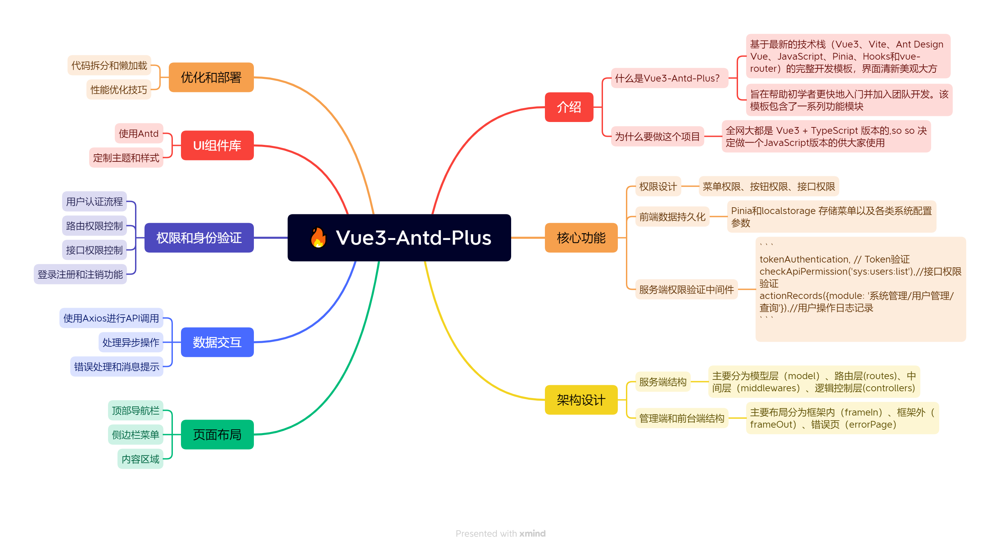


---


## 截图(管理后台+web前台)
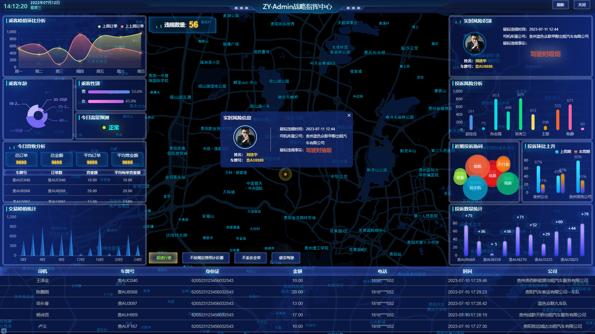
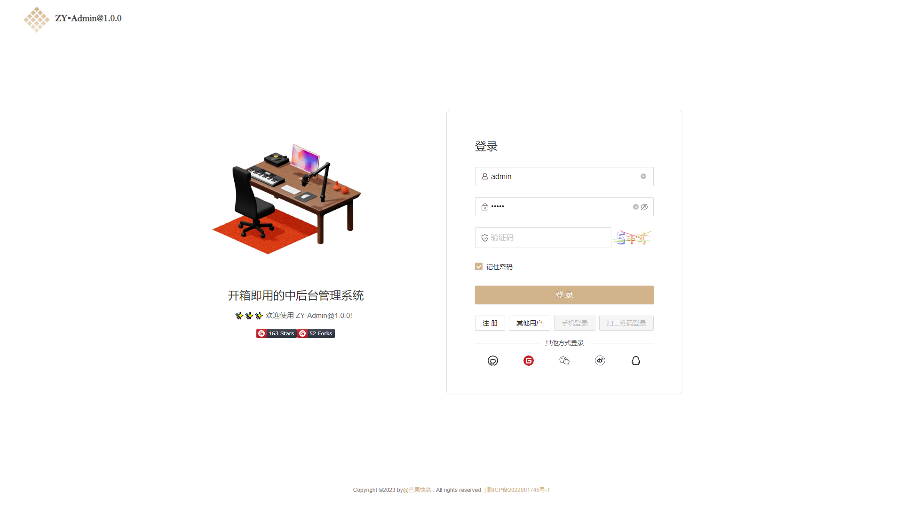
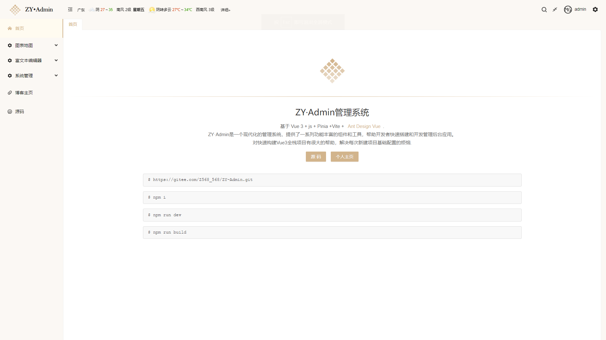
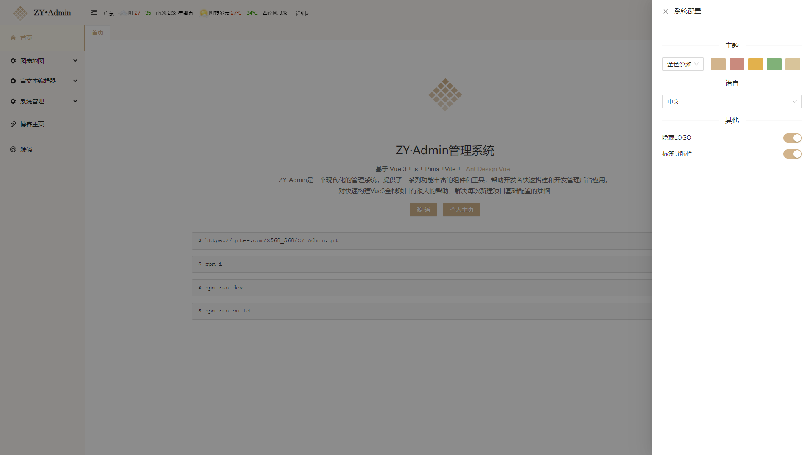
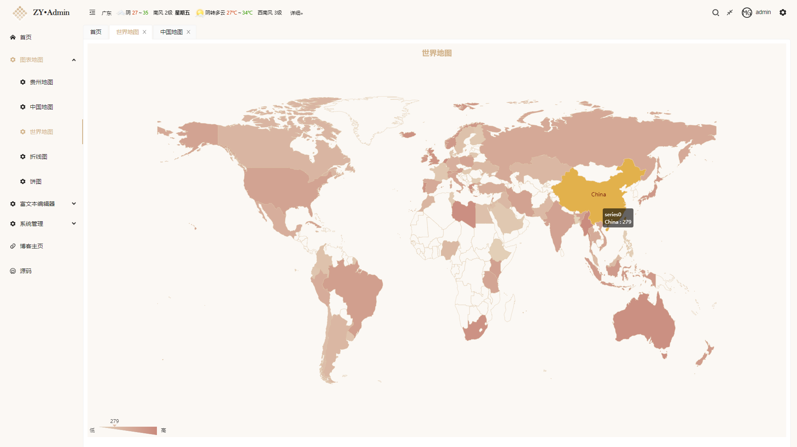
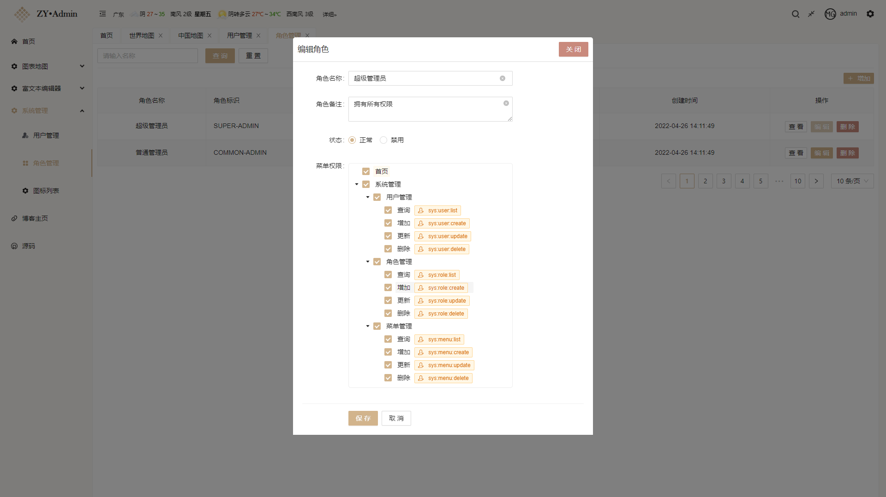
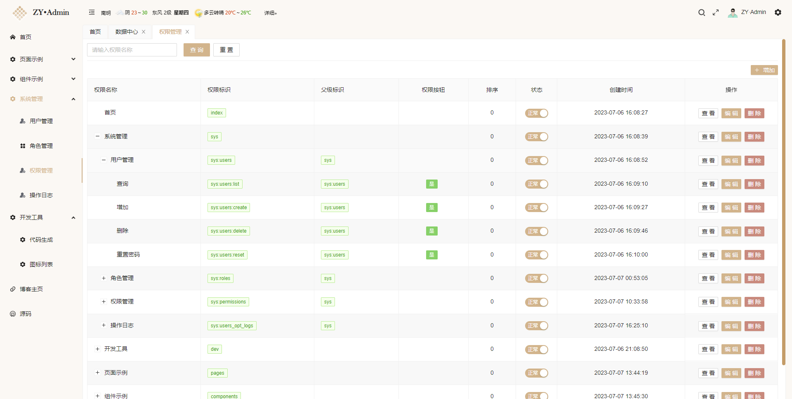
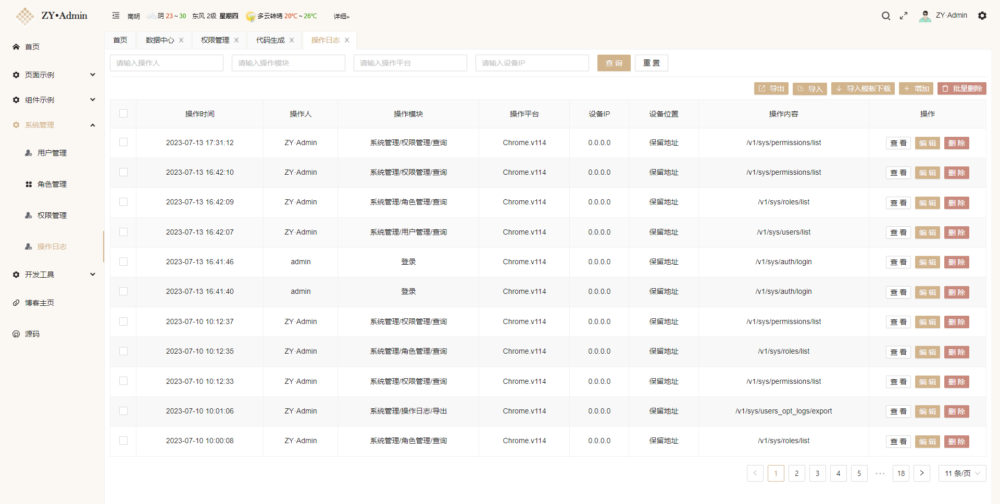
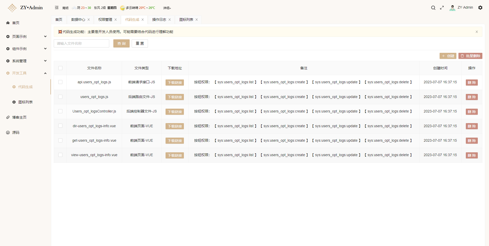


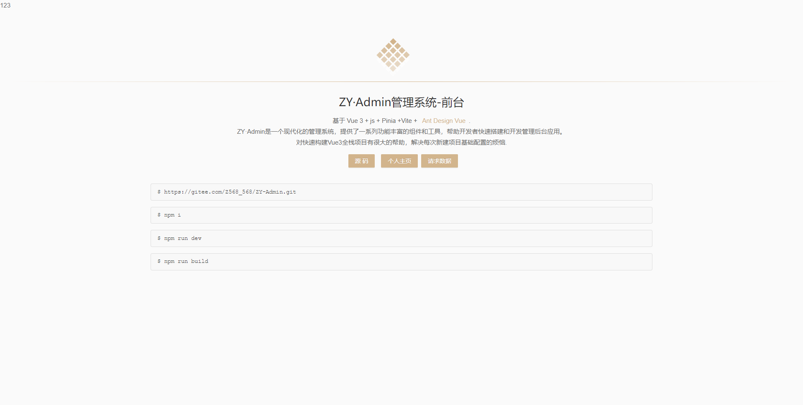


## 功能特性

- 使用 Vue 3 和 Vite 构建，具备高效的开发体验和优秀的性能表现
- 集成了 Ant Design Vue 组件库，提供美观的 UI 界面和丰富的组件选项 和主题切换
- 使用 Vue Router 实现路由管理，支持多层级路由和动态路由
- 使用 Axios 处理 HTTP 请求，与后端进行数据交互
- 集成 ECharts 图表库，展示数据统计和可视化效果
- 使用 Pinia 进行状态管理，提供了一种响应式的数据流方案
- 集成 Tinymce 富文本编辑器和 Vditor Markdown 编辑器，满足不同的编辑需求
- 使用 hotkeys-js 提供快捷键支持，增强用户操作体验
- 使用 Lodash 提供常用工具函数，简化开发流程
- 集成了测试工具集 @vue/test-utils 和 vitest，方便进行单元测试
- 更多....

#### 我的其他开源项目
>[😜博客全栈系统 vue2 + node.js](https://gitee.com/Z568_568/all-blog-sys.git)

>[个人文件管理+图床管理服务系统](https://gitee.com/Z568_568/zy.files.sys.git)

>[node+mysql后端api基础服务模板](https://gitee.com/Z568_568/zy-express-sequelize-mysql)

>[node+mongodb开发REST API 的轻量级样板](https://gitee.com/Z568_568/node.mongodb)


## 快速开始

1. 克隆本仓库到本地

   ```
   https://gitee.com/Z568_568/vue3-antd-plus.git
   ```

2. admin/client/server安装依赖

   ```
   npm install
   ```

3. admin/client/server本地启动

   ```
   npm run dev
   ```

4. 打包生产环境

   ```
   npm run build
   ```
## admin添加路由页面

```
/**
 * 在主框架内显示
 * 路由配置说明
 * {
      path: '/dir-demo-info',    // 页面地址（唯一）
      name: 'dir-demo-info',     // 页面名称（唯一）
      hidden: false,              // 隐藏（不展示在侧边栏菜单）
      meta: {
          title: '用户管理',       // 页面标题
          icon: 'yonghuguanli',  // 页面图标
          cache: true,          // 页面是否进行缓存 默认true
          link: false,           // 页面是否是外链 默认false
          frameSrc: false,       // 页面是否是内嵌 默认false
          requiresAuth: true,   // 页面是否是需要登录 默认true
          perms: [               // 页面的操作的权限列表
              'sys:user:list',   // 查询
              'sys:user:create', // 增加
              'sys:user:update', // 更新
              'sys:user:delete', // 删除
          ],
      },
      component: () => import('@/views/sys/user/dir-user-info.vue'),
   }
 *
 */
```

....


## 贡献

欢迎对Vue3-Antd-Plus项目的改进和完善，如果您发现任何错误或有任何建议，请随时提交问题和拉取请求。

## 版权

Vue3-Antd-Plus是一个开源项目，根据MIT许可证发布。有关更多信息，请参阅LICENSE文件。

## 联系方式

如果你有任何问题或建议，请通过以下方式联系我：

- 邮箱：1840354092@qq.com
- 微信：

####  赞赏作者

 
 


